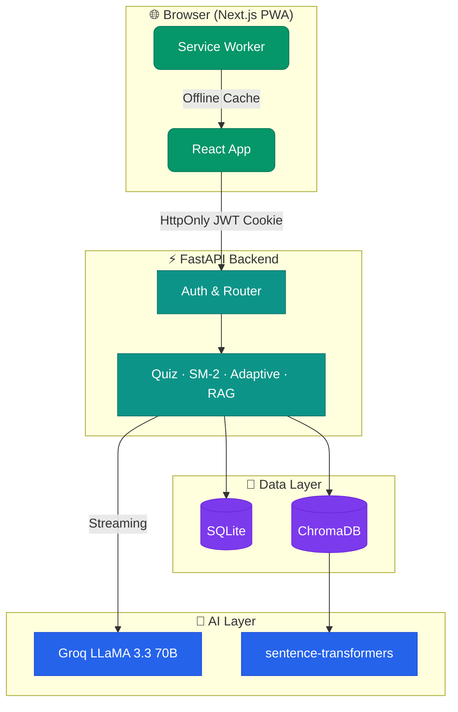

<div align="center">


<br/>

[](https://nextjs.org/)
[](https://fastapi.tiangolo.com/)
[](https://python.org/)
[](https://sqlite.org/)
[](https://groq.com/)

[](https://github.com/Tayab-Ahamed/AI-Sakhi/actions)
[](LICENSE)
[](https://github.com/Tayab-Ahamed/AI-Sakhi)

<br/>

> **AI Sakhi** is a full-stack multilingual tutoring platform for Indian students (Class 1–12).  
> Chat with an AI tutor in your own language, take adaptive quizzes, review flashcards,  
> and track everything — all in one place, for students, teachers, parents, and admins.

<br/>

</div>

---

## ✨ Features at a Glance

<table>
<tr>
<td width="50%">

### 🎓 For Students
- 💬 **Multilingual AI Chat** — English, Hindi, Hinglish, Kannada, Tamil
- 🎯 **Adaptive Quizzes** — auto-adjusts difficulty based on your performance
- 🃏 **Spaced Repetition Flashcards** — SM-2 algorithm keeps your memory sharp
- 📊 **Topic Mastery Heatmap** — know exactly where to focus
- 🔥 **Streaks & XP System** — stay motivated with gamification
- 📝 **Study Notes & Practice Papers** — AI-generated, curriculum-aligned
- ⏱️ **Focus Timer** — Pomodoro sessions with study time tracking

</td>
<td width="50%">

### 👩‍🏫 For Teachers
- 📋 **Assignment Management** — create, edit, track by class & topic
- 📈 **Class Analytics** — completion rates, average scores, struggling students
- ✍️ **AI Feedback Suggestions** — click-to-use personalized feedback phrases
- 📤 **Progress Reports** — export student data

### 👨‍👩‍👧 For Parents
- 👀 **Child Progress View** — streaks, scores, weak subjects at a glance
- 🔔 **Smart Notifications** — get alerted when your child needs attention

### 🛡️ For Admins
- 👥 **User Management** — roles, deactivation, org join codes
- 📊 **Activity Dashboard** — organization-wide engagement metrics

</td>
</tr>
</table>

---

## 🏗️ Architecture



---

## 🛠️ Tech Stack

| Layer | Technology | Why |
|:---|:---|:---|
| **Frontend** | Next.js 16, React, Framer Motion | App Router, streaming, beautiful animations |
| **Styling** | Vanilla CSS with CSS variables | No framework bloat, full dark mode support |
| **Backend** | FastAPI, Python 3.11 | Async-first, fast, clean API design |
| **Database** | SQLite | Zero-config, runs everywhere, no server needed |
| **Vector DB** | ChromaDB + sentence-transformers | Semantic search over NCERT textbooks |
| **LLM** | Groq API — LLaMA 3.3 70B | Ultra-fast inference, multilingual |
| **Auth** | HttpOnly JWT cookies | XSS-safe session management |

---

## 🚀 Quick Start

### Prerequisites
- Python 3.11+
- Node.js 20+
- A free [Groq API key](https://console.groq.com)

### 1. Clone & configure

```bash
git clone https://github.com/Tayab-Ahamed/AI-Sakhi.git
cd AI-Sakhi
cp .env.example .env
# Open .env and add your GROQ_API_KEY
```

### 2. Run the backend

```bash
python -m venv venv

# Windows
venv\Scripts\activate
# macOS / Linux
source venv/bin/activate

pip install -r requirements.txt
python -m uvicorn backend.main:app --host 127.0.0.1 --port 8000 --reload
```

API → `http://localhost:8000` · Swagger docs → `http://localhost:8000/docs`

### 3. Run the frontend

```bash
cd frontend
npm install
npm run dev
```

App → `http://localhost:3000`

---

## 🐳 Docker

```bash
docker compose up --build
```

| Service | URL |
|---|---|
| Frontend | http://localhost:3000 |
| Backend API | http://localhost:8000 |

---

## 📚 Load Textbook Content (RAG)

Drop NCERT PDFs into `rag_data/ncert/` then run:

```bash
python ingest.py
```

Once complete, the chat sidebar shows **RAG Active** and answers will cite exact textbook sources.

---

## 📂 Project Structure

```
AI-Sakhi/
├── backend/
│   ├── main.py              # All API routes
│   ├── db.py                # Schema, migrations, queries
│   ├── auth.py              # JWT + bcrypt auth
│   ├── chat.py              # Groq streaming + RAG
│   ├── quiz.py              # Quiz generation & evaluation
│   ├── adaptive.py          # Difficulty calibration engine
│   ├── spaced_repetition.py # SM-2 algorithm
│   ├── recommendations.py   # Weak topic detection
│   ├── study_notes.py       # AI study notes generator
│   ├── flashcards.py        # Flashcard generation
│   ├── study_plan.py        # Personalised study plans
│   └── teacher_tools.py     # Assignment analytics
│
├── frontend/src/
│   ├── app/                 # Pages: chat, quiz, teacher, admin, parent…
│   ├── components/          # Sidebar, XPBar, NotificationCenter, TourGuide
│   └── lib/                 # API client, user context, theme, session timer
│
├── curriculum/              # CBSE/NCERT topic maps per class & subject
├── rag_data/                # Put your PDFs here
├── ingest.py                # RAG ingestion script
├── docker-compose.yml
└── requirements.txt
```

---

## 👤 Roles

| Role | What they can do |
|:---|:---|
| `student` | Chat, quiz, flashcards, notes, focus timer, leaderboard |
| `teacher` | Everything above + assignments, class analytics, reports |
| `parent` | Child progress, streaks, score history |
| `admin` | User management, roles, org join codes, activity stats |

---

## 🧪 Tests

**Backend (pytest)**
```bash
pytest
```

**Frontend (type check + build)**
```bash
cd frontend && npm run build
```

Both run automatically on every push via GitHub Actions.

---

<div align="center">


**Built for students across India 🇮🇳**

*If this helped you, consider giving it a ⭐*

</div>
