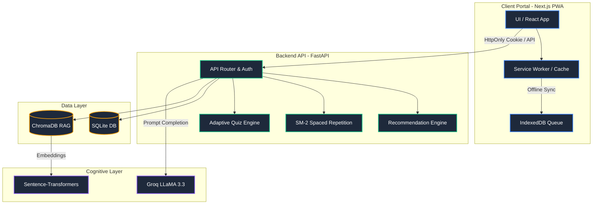

# 🌸 AI Sakhi — Production-Grade Multilingual AI Learning Platform & Intelligent Tutoring System

> A comprehensive, full-stack educational ecosystem combining an emotionally intelligent multilingual AI tutor, custom RAG pipelines, spaced-repetition card tracking, parent/teacher dashboards, and offline-resilient PWA support.

[](https://nextjs.org/)
[](https://fastapi.tiangolo.com/)
[](https://sqlite.org/)
[](https://github.com/chroma-core/chroma)
[-8b5cf6?style=flat-square)](https://groq.com/)
[](https://github.com/Tayab-Ahamed/AI-Sakhi/actions)
[](#)

---

## 🎯 Project Overview

**AI Sakhi** is a production-grade, state-of-the-art educational platform designed to bridge the accessibility and engagement gap for students across India. Unlike simple chat wrappers, AI Sakhi implements full-stack pedagogical logic—including **SuperMemo SM-2 Spaced Repetition**, **Adaptive Learning Thresholds**, local RAG semantic search, and structured offline workflows—to deliver a personalized, distraction-free educational companion.

The platform is designed to cater to multiple core personas:
*   **Students**: Access a gamified, multilingual study experience with voice inputs, adaptive quiz flows, and customizable interfaces.
*   **Teachers**: Assign targeted, curriculum-aligned tasks and monitor classroom submission scores in real-time.
*   **Parents**: Monitor streaks, track performance heatmaps, and receive automated "needs attention" alert summaries.
*   **Administrators**: Seamlessly manage organization-wide user privileges and roles directly inside an integrated console.

---

## 🚀 Key Engineering & Technical Highlights

### 1. Intelligent Conversational Agent & Local RAG Pipeline
*   **High-Speed LLM Inference**: Integrated with Groq-accelerated **LLaMA 3.3 (70B)** and LLaVa for ultra-low-latency multilingual responses, contextual explanations, and image/diagram analyses.
*   **NCERT Curriculum Grounding**: Custom retrieval-augmented generation (RAG) backend utilizing a local **ChromaDB** vector database. Textbooks are parsed, preprocessed, dynamically chunked, and embedded via `sentence-transformers` (`all-MiniLM-L6-v2`) to provide source-cited answers referencing precise page numbers.

### 2. Algorithmic Spaced Repetition (SuperMemo SM-2)
*   **Pedagogical Review Scheduler**: Employs a mathematical implementation of the **SM-2 algorithm** that tracks student self-assessments (Forgot, Hard, Okay, Easy).
*   **Smart Queuing**: Dynamically computes next-review dates, tracking rolling repetitions and individual card *easiness factors* (EF) clamped at a minimum of `1.3` to ensure optimal memory retention.

### 3. Adaptive Learning & Dynamic Quizzing
*   **Automated Difficulty Calibration**: Analyzes the student's rolling quiz history to auto-adjust MCQ difficulties between Easy, Medium, and Hard, aligning quizzes dynamically to the student's current learning curve.
*   **Weak-Topic Recommendations**: Aggregates performance data per curriculum category to recommend hyper-specific review topics and dynamically generate tailored AI study guides.

### 4. Resilient Offline PWA Capability
*   **Offline-First Quizzing**: Custom Service Workers feature cache-first static asset delivery alongside network-first API request fallbacks, allowing students to access cached quizzes without active internet connection.
*   **Dynamic Write Syncing**: Integrated IndexedDB buffer queue captures quiz records and student progress while offline, automatically scheduling a sync-back to the primary FastAPI server the moment connectivity resumes.

### 5. Hardened Security & Enterprise Features
*   **Secure Cookie Authentication**: Transitioned from bearer tokens in localStorage to **HttpOnly, SameSite, Secure Cookie-based JWT exchange** to fully eliminate cross-site scripting (XSS) risks.
*   **Granular CORS Rules**: Transitioned backend CORS configurations to an explicit domain whitelist with `allow_credentials=True` support.
*   **React Error Boundaries**: Custom-styled UI Error Boundary handles runtime script exceptions gracefully, providing inline diagnostics and immediate state-recovery hooks to prevent total client crashes.

### 6. Dyslexia-Inclusive & Accessible Design
*   **Dyslexia Workspace Mode**: Seamless toggle implementing the open-source **OpenDyslexic typeface**, a soft cream color scheme, and enhanced word-spacing to support neurodivergent learners.
*   **Reduce Motion configurations**: Comprehensive switch which disables CSS transitions/animations across all dashboards to ensure high comfort and standard accessibility compliance.

---

## 🏗️ System Architecture



---

## 🛠️ Technology Stack

| Layer | Technologies | Key Role / Highlight |
| :--- | :--- | :--- |
| **Frontend UI** | **Next.js 15 (App Router)**, React 18, Framer Motion | Modern, server-rendered components, rich animations, and high SEO performance. |
| **Styling** | **Vanilla CSS** | Pure custom layouts, fast loading times, free of bulky external CSS frameworks. |
| **PWA Services** | **Service Workers**, **IndexedDB**, Workbox | Enabling offline caching, local data queuing, and native app installations. |
| **Backend API** | **FastAPI**, Python 3.11, Uvicorn | High-performance asynchronous API endpoints, fast request routing. |
| **Database** | **SQLite**, SQLModel / SQLAlchemy | Solid local persistence, rapid transaction capabilities. |
| **Vector Engine**| **ChromaDB**, `sentence-transformers` | Core semantic search vector space for NCERT curriculum RAG indexing. |
| **Inference API**| **Groq API** (LLaMA 3.3 70B, LLaVa) | Low-latency response streams, image explanations, multilingual tutoring. |
| **Tests & CI**   | **pytest**, **Vitest**, GitHub Actions | Comprehensive automated testing coverage, strict compile validations. |

---

## 📂 Repository Structure

```text
AI-Sakhi/
├── .github/
│   └── workflows/
│       └── main.yml            # CI/CD pipeline (pytest & vitest build checks)
├── backend/
│   ├── main.py                 # FastAPI application root & API router configuration
│   ├── config.py               # Global environment settings & variables
│   ├── db.py                   # SQLite schemas, connection sessions, and models
│   ├── auth.py                 # Secure HttpOnly cookie handling & JWT utilities
│   ├── chat.py                 # Groq LLaMA integration & advanced prompting engines
│   ├── adaptive.py             # Performance-tracking adaptive difficulty engine
│   ├── spaced_repetition.py    # SM-2 algorithm scheduler core logic
│   ├── recommendations.py      # Weak-topic analyzer & curriculum recommender
│   ├── teacher_tools.py        # Classroom assignment workflows & grade metrics
│   ├── study_notes.py          # AI structured markdown notes generator
│   └── tests/                  # Backend unit & integration test suites
├── frontend/
│   ├── src/
│   │   ├── app/                # Next.js App Router workspace
│   │   │   ├── chat/           # Voice-enabled conversational AI workspace
│   │   │   ├── quiz/           # Dynamic MCQ quizzes
│   │   │   ├── flashcards/     # Spaced-repetition card dashboards
│   │   │   ├── dashboard/      # Interactive student analytics dashboard
│   │   │   ├── study-notes/    # Custom study guide generator
│   │   │   ├── teacher/        # Assignments and classroom insights
│   │   │   ├── parent/         # Home streaks & low-score alert portals
│   │   │   └── admin/          # Granular role & access dashboard
│   │   ├── components/         # Premium reusable UI cards, boundaries, and panels
│   │   ├── lib/                # API Client fetch, global logging tools, React Contexts
│   │   └── test/               # React test framework configurations
│   ├── package.json            # Frontend modules & scripts
│   ├── tsconfig.json           # Strict TypeScript configuration
│   └── vitest.config.ts        # Unit test suite runner settings
├── curriculum/                 # Structured CBSE/NCERT curriculum templates
├── docker-compose.yml          # Multi-container production compose recipe
├── Dockerfile.backend          # Minimalist Python FastAPI build definition
├── Dockerfile.frontend         # Standalone Next.js Node production runner
└── requirements.txt            # Python environment dependencies
```

---

## 🚀 Setting Up the Project Locally

Follow these instructions to run the complete, connected workspace locally.

### 📋 Prerequisites
*   **Python 3.11+**
*   **Node.js 20+**
*   A free [Groq API Key](https://console.groq.com)

---

### Step 1: Clone & Configure

1. Clone the repository and navigate to the directory:
   ```bash
   git clone https://github.com/Tayab-Ahamed/AI-Sakhi.git
   cd AI-Sakhi
   ```

2. Generate the backend configuration file:
   ```bash
   cp .env.example .env
   ```
   *Open `.env` and assign your `GROQ_API_KEY` (e.g., `GROQ_API_KEY=gsk_...`).*

---

### Step 2: Spin Up the Backend Server

1. Create a virtual python environment:
   ```bash
   cd backend
   python -m venv venv
   ```

2. Activate the virtual environment:
   *   **Windows**:
       ```powershell
       venv\Scripts\activate
       ```
   *   **macOS / Linux**:
       ```bash
       source venv/bin/activate
       ```

3. Install required packages and run the application:
   ```bash
   pip install -r requirements.txt
   python -m uvicorn backend.main:app --host 127.0.0.1 --port 8000 --reload
   ```
   *The FastAPI server will start on [http://127.0.0.1:8000](http://127.0.0.1:8000). The swagger docs are reviewable at [http://127.0.0.1:8000/docs](http://127.0.0.1:8000/docs).*

---

### Step 3: Run the Next.js Frontend

1. Navigate to the frontend directory:
   ```bash
   cd ../frontend
   ```

2. Install dependencies:
   ```bash
   npm install
   ```

3. Start the local server in development mode:
   ```bash
   npm run dev
   ```
   *The frontend dashboard will run at [http://localhost:3000](http://localhost:3000).*

---

## 🐳 Running with Docker

AI Sakhi is configured for containerized orchestration. To build and run both the API backend and PWA frontend simultaneously:

```bash
docker compose up --build
```

*   **PWA Interface**: [http://localhost:3000](http://localhost:3000)
*   **API Service**: [http://localhost:8000](http://localhost:8000)
*   **Persisted Storage**: SQLite databases are continuously written and persisted within local `./data/` directories.

---

## 🧪 Comprehensive Verification & Testing

The platform maintains complete automated test suites across both the React components and Python logic layers.

### 🐍 Backend Tests (Pytest)
Executes logic checks covering our mathematical SM-2 models, adaptive difficulties, and topic weight rankings:
```bash
# From the root directory:
.\venv\Scripts\pytest backend/tests/ -v
```
*Expected output: All 21 tests passed (SM-2 queues, difficulty boundaries, ranking logic).*

### ⚛️ Frontend Tests (Vitest)
Validates components, navigation controls, user roles, and accessible mode operations:
```bash
# From the frontend directory:
npm run test
```
*Expected output: All test cases fully passed.*

---

## 📖 RAG Pipeline Ingestion

To ground the AI tutor with specific textbook knowledge:

1. Place your target textbook PDFs inside: `rag_data/ncert/`
2. Run the ingestion pipeline to parse, chunk, embed, and index files into ChromaDB:
   ```bash
   python ingest.py
   ```
3. Once completed, the AI Tutor sidebar will show an **"Active RAG Mode"** indicator, and chat replies will cite exact sources.

---

## 📄 License
Distributed under the MIT License. See `LICENSE` for details.

---

<div align="center">
  <p>Engineered with ❤️ for students, parents, and educators.</p>
</div>
