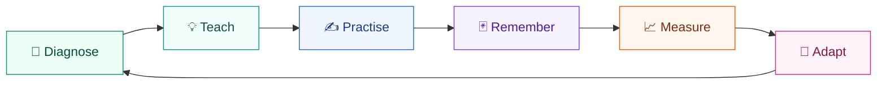
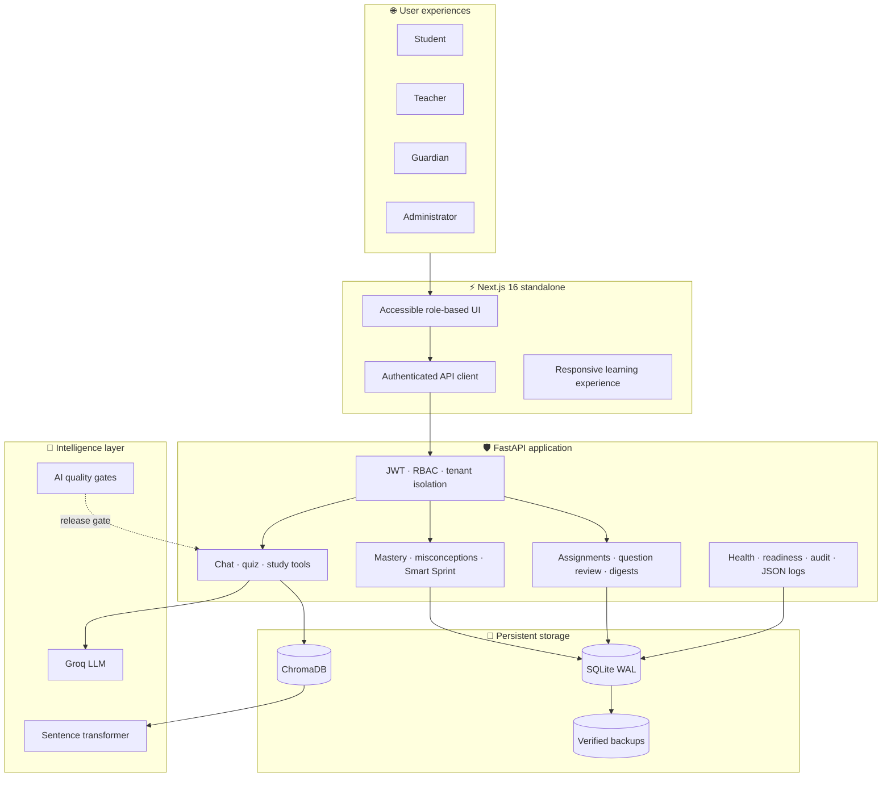
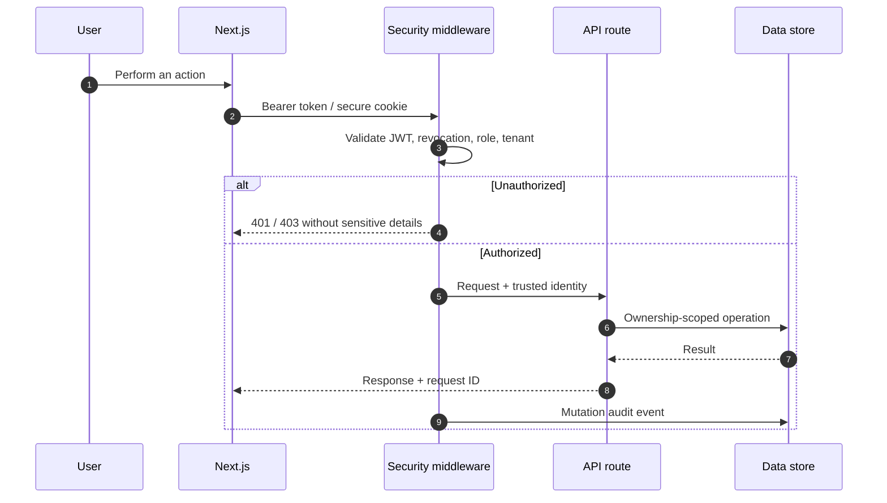
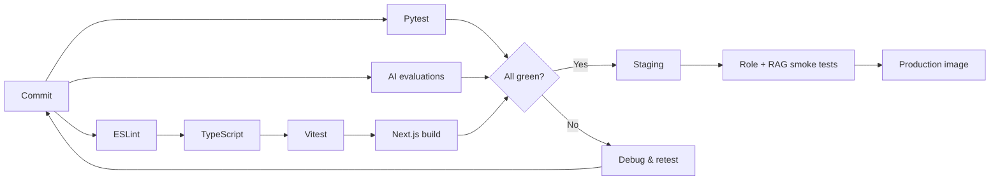

<div align="center">


[](https://github.com/Tayab-Ahamed/AI-Sakhi/actions)
[](https://nextjs.org/)
[](https://fastapi.tiangolo.com/)
[](https://python.org/)
[](https://groq.com/)
[](LICENSE)

<br />

> **AI Sakhi** is not just another chatbot. It is an evidence-aware learning platform that discovers misconceptions, builds focused study sprints, schedules memory reviews, and gives teachers and guardians useful—not overwhelming—insight.

[🚀 Deploy](#-production-deployment) · [✨ Features](#-experiences-built-for-every-role) · [🧠 Intelligence](#-ai--learning-models) · [🏗 Architecture](#-architecture) · [🧪 Quality](#-release-quality-gates)

</div>

---

## 🌟 Why AI Sakhi stands out

<table>
<tr>
<td width="33%" align="center">
<h3>📚 Evidence first</h3>
Answers can carry textbook, chapter, and page-level evidence instead of invented citations.
</td>
<td width="33%" align="center">
<h3>🧠 Learner aware</h3>
Mastery, recency, difficulty, hints, and misconceptions shape what a learner sees next.
</td>
<td width="33%" align="center">
<h3>🫶 Safety by design</h3>
Role isolation, privacy workflows, minimal-data safeguarding, and supportive language are built in.
</td>
</tr>
</table>


```mermaid
flowchart LR
    A[🔎 Diagnose] --> B[💡 Teach]
    B --> C[✍️ Practise]
    C --> D[🃏 Remember]
    D --> E[📈 Measure]
    E --> F[🎯 Adapt]
    F --> A

    style A fill:#ecfdf5,stroke:#059669,color:#064e3b
    style B fill:#f0fdfa,stroke:#0d9488,color:#134e4a
    style C fill:#eff6ff,stroke:#2563eb,color:#1e3a8a
    style D fill:#f5f3ff,stroke:#7c3aed,color:#4c1d95
    style E fill:#fff7ed,stroke:#ea580c,color:#7c2d12
    style F fill:#fdf2f8,stroke:#db2777,color:#831843
```

---

## ✨ Experiences built for every role

<table>
<tr>
<td width="50%" valign="top">

### 🎓 Students

- 💬 Multilingual, streaming AI tutoring
- 📖 Page-attributed NCERT retrieval
- 🎯 Personalized **Smart Sprints**
- 🧩 Explainable misconception detection
- 📊 Topic mastery and confidence
- 🃏 SM-2 spaced-repetition flashcards
- 📝 Quizzes, notes, study plans, and practice papers
- ⏱ Focus sessions, goals, streaks, XP, and artifacts

</td>
<td width="50%" valign="top">

### 👩‍🏫 Teachers

- ✅ Reviewed curriculum question bank
- 📚 Board, class, subject, chapter, and outcome tags
- 📋 Assignment and submission workflows
- 📈 Class analytics and intervention signals
- ✍️ AI-assisted feedback suggestions

### 👨‍👩‍👧 Guardians & Admins

- 🌱 Positive weekly guardian digests
- 🔐 Parent-child ownership isolation
- 🏫 Organization-level role controls
- 🧾 Audit trails and account administration

</td>
</tr>
</table>

---

## 🧠 AI & learning models

| Intelligence layer | Model / algorithm | What it improves |
|---|---|---|
| Conversational tutoring | Groq-hosted LLaMA via configurable `GROQ_MODEL` | Fast multilingual explanations |
| Textbook retrieval | `all-MiniLM-L6-v2` + ChromaDB cosine search | Relevant curriculum evidence |
| Memory scheduling | SM-2 spaced repetition | Long-term recall |
| Adaptive difficulty | Performance-based calibration | Better challenge balance |
| Mastery | Accuracy × difficulty × recency × hint penalty | Explainable topic confidence |
| Misconceptions | Deterministic auditable classifier | Targeted remediation |
| Quality evaluation | Deterministic release-gate suite | Prevents unsafe or unsupported regressions |

<details>
<summary><b>🔍 How textbook grounding works</b></summary>

1. PDFs are processed page by page.
2. Each chunk stores source, page, board, class, subject, and chapter metadata.
3. ChromaDB retrieves semantically relevant evidence.
4. Weak matches above `RAG_MAX_DISTANCE` are rejected.
5. Evidence boundaries are sent explicitly to the tutor.
6. The system prompt prohibits unsupported source claims.

</details>

---

## 🏗 Architecture


```mermaid
flowchart TB
    subgraph Clients["🌐 User experiences"]
        Student[Student]
        Teacher[Teacher]
        Parent[Guardian]
        Admin[Administrator]
    end

    subgraph Frontend["⚡ Next.js 16 standalone"]
        UI[Accessible role-based UI]
        APIClient[Authenticated API client]
        PWA[Responsive learning experience]
    end

    subgraph Backend["🛡 FastAPI application"]
        Security[JWT · RBAC · tenant isolation]
        Tutor[Chat · quiz · study tools]
        Adaptive[Mastery · misconceptions · Smart Sprint]
        School[Assignments · question review · digests]
        Ops[Health · readiness · audit · JSON logs]
    end

    subgraph Intelligence["🧠 Intelligence layer"]
        Groq[Groq LLM]
        Embed[Sentence transformer]
        Eval[AI quality gates]
    end

    subgraph Storage["💾 Persistent storage"]
        SQLite[(SQLite WAL)]
        Chroma[(ChromaDB)]
        Backups[(Verified backups)]
    end

    Clients --> UI --> APIClient --> Security
    Security --> Tutor
    Security --> Adaptive
    Security --> School
    Tutor --> Groq
    Tutor --> Chroma
    Chroma --> Embed
    Adaptive --> SQLite
    School --> SQLite
    Ops --> SQLite
    SQLite --> Backups
    Eval -. release gate .-> Tutor
```

### Security request path


```mermaid
sequenceDiagram
    autonumber
    participant U as User
    participant N as Next.js
    participant S as Security middleware
    participant A as API route
    participant D as Data store

    U->>N: Perform an action
    N->>S: Bearer token / secure cookie
    S->>S: Validate JWT, revocation, role, tenant
    alt Unauthorized
        S-->>N: 401 / 403 without sensitive details
    else Authorized
        S->>A: Request + trusted identity
        A->>D: Ownership-scoped operation
        D-->>A: Result
        A-->>N: Response + request ID
        S->>D: Mutation audit event
    end
```

---

## 🛡 Production safeguards

- Central JWT authentication, revocation, inactive-user checks, and secure production cookies
- Role-based access and cross-organization isolation
- Login lockout, global rate limiting, and restricted privileged invitations
- Upload size/type/page validation and protected artifacts
- Request IDs, security headers, structured JSON logs, and latency metrics
- Optional Sentry monitoring with default PII disabled
- Fail-fast production configuration and deployment preflight
- Non-root, multi-stage production containers (see `Dockerfile.backend`)
- Liveness and readiness endpoints
- Online-safe SQLite backups with integrity checks and retention
- Privacy export/request workflows and minimal safeguarding-event storage

> [!IMPORTANT]
> The packaged architecture supports a **single backend host** with persistent SQLite and ChromaDB volumes. Do not run multiple backend hosts against the same SQLite file. Move to PostgreSQL before horizontal scaling.

---

## 🚀 Quick start

### Prerequisites

- Python 3.11+
- Node.js 20+
- A Groq API key

```bash
git clone https://github.com/Tayab-Ahamed/AI-Sakhi.git
cd AI-Sakhi
cp .env.example .env
```

Generate a strong signing secret:

```bash
python -c "import secrets; print(secrets.token_urlsafe(64))"
```

### Backend

```bash
python -m venv .venv
source .venv/bin/activate       # Windows: .venv\Scripts\activate
pip install -r requirements.txt
uvicorn backend.main:app --reload
```

### Frontend

```bash
cd frontend
npm ci
npm run dev
```

| Surface | Development URL |
|---|---|
| Student app | `http://localhost:3000` |
| Backend API | `http://localhost:8000` |
| OpenAPI | `http://localhost:8000/docs` |
| Readiness | `http://localhost:8000/ready` |

---

## 📚 Load textbook evidence

Put PDFs in `rag_data/ncert/` using a metadata-friendly name:

```text
CBSE_Class8_Science_Chapter5_Atoms.pdf
```

```bash
python ingest.py
```

The ingestion pipeline preserves page-level attribution. No textbook content is included in the repository.

---

## 🐳 Production deployment

### 1. Configure

```bash
cp .env.example .env
# Add the Groq key, generated JWT secret, and real HTTPS URLs.
```

Required values:

| Variable | Production requirement |
|---|---|
| `GROQ_API_KEY` | Real secret key |
| `SAKHI_JWT_SECRET` | At least 32 random bytes |
| `SAKHI_ENV` | `production` |
| `SAKHI_ENABLE_DEMO_SEED` | `false` |
| `ALLOWED_ORIGINS` | Explicit HTTPS frontend origins |
| `NEXT_PUBLIC_API_URL` | Public HTTPS backend URL |
| `SENTRY_DSN` | Optional monitoring endpoint |

### 2. Validate and launch

```bash
set -a; source .env; set +a
python scripts/preflight.py

docker compose config
docker compose build --pull
docker compose up -d
```

### 3. Verify

```bash
curl -fsS https://api.example.com/health
curl -fsS https://api.example.com/ready
docker compose ps
```

Terminate TLS at a trusted reverse proxy or load balancer. Deploy the exact image that passed CI—never rebuild unverified source directly on the production host.

---

## 💾 Backup and recovery

```bash
python scripts/backup_sqlite.py \
  --database data/sakhi.db \
  --output-dir backups \
  --retain 14
```

Schedule daily backups, encrypt them, and copy them off-host. Test restoration regularly—not only when an incident occurs.

---

## 🧪 Release quality gates


```mermaid
flowchart LR
    Commit[Commit] --> Py[Pytest]
    Commit --> Eval[AI evaluations]
    Commit --> Lint[ESLint]
    Lint --> Types[TypeScript]
    Types --> Unit[Vitest]
    Unit --> Build[Next.js build]
    Py --> Gate{All green?}
    Eval --> Gate
    Build --> Gate
    Gate -->|Yes| Stage[Staging]
    Gate -->|No| Fix[Debug & retest]
    Fix --> Commit
    Stage --> Smoke[Role + RAG smoke tests]
    Smoke --> Release[Production image]
```

Run locally:

```bash
pytest
python evals/run_evals.py
cd frontend
npm ci
npm run lint
npx tsc --noEmit
npm test
npm run build
```

The AI evaluation gate checks unsupported citations, required terms, forbidden language, uncertainty handling, safety support, and response length.

---

## 📁 Project map

```text
AI-Sakhi/
├── backend/                  # FastAPI APIs, security, learning engines
│   ├── adaptive_routes.py   # Smart Sprints, mastery, misconceptions
│   ├── learning_engine.py   # Explainable adaptive logic
│   ├── teacher_review_routes.py
│   ├── privacy_safety_routes.py
│   ├── observability.py
│   └── tests/
├── frontend/src/            # Next.js role-based experience
├── curriculum/              # Curriculum maps
├── evals/                   # Deterministic AI quality suite
├── scripts/                 # Preflight and backup utilities
├── ingest.py                # Page-attributed textbook ingestion
├── docker-compose.yml
└── .env.example
```

---

## 🔐 Privacy and safeguarding

AI Sakhi stores only minimal context for safeguarding events and provides data-export and deletion-request workflows. Before serving minors, qualified legal and safeguarding reviewers must approve consent, retention, escalation, emergency, and deletion procedures for every deployment region.

AI responses provide educational and supportive guidance; they are not medical, legal, or emergency services.

---

## 🤝 Contributing

1. Create a focused branch.
2. Add or update tests.
3. Run every release gate.
4. Avoid committing secrets, databases, models, textbook PDFs, caches, or build output.
5. Open a pull request explaining the learning or safety outcome—not only the code change.

---

<div align="center">

### Built for curious learners across India 🇮🇳

**Trust the evidence. Understand the learner. Improve every session.**

[](https://github.com/Tayab-Ahamed/AI-Sakhi)
[](https://github.com/Tayab-Ahamed/AI-Sakhi/fork)


</div>
